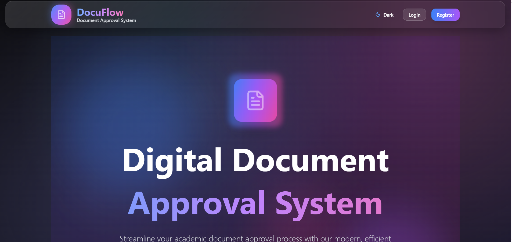

# Digital Document Approval System - Backend

This is the backend API for the Digital Document Approval System, built with Node.js, Express, and MongoDB.
Backend did not deployed 

## Features

- **User Management**: Registration, authentication, and role-based access control
- **Document Management**: Upload, approval workflow, and tracking
- **Digital Signatures**: Faculty signature upload and verification
- **Approval System**: Faculty can approve/reject documents with comments
- **Analytics**: Comprehensive system analytics and reporting
- **Security**: JWT authentication, input validation, and rate limiting

## Tech Stack

- **Runtime**: Node.js
- **Framework**: Express.js
- **Database**: MongoDB with Mongoose ODM
- **Authentication**: JWT (JSON Web Tokens)
- **Password Hashing**: bcryptjs
- **Validation**: express-validator
- **File Upload**: Multer
- **Security**: Helmet, CORS, Rate Limiting

## Prerequisites

- Node.js (v16 or higher)
- MongoDB (v4.4 or higher)
- npm or yarn

## Installation

1. **Clone the repository and navigate to backend directory:**
   ```bash
   cd backend
   ```

2. **Install dependencies:**
   ```bash
   npm install
   ```

3. **Environment Configuration:**
   - Copy `env.example` to `.env`
   - Update the environment variables with your configuration:
     ```env
     # Server Configuration
     PORT=5000
     NODE_ENV=development
     
     # Database
     MONGODB_URI=mongodb:your mongobd url
     
     # JWT Configuration
     JWT_SECRET=your-super-secret
     JWT_EXPIRES_IN=7d
     
     # Frontend URL
     FRONTEND_URL=http://localhost:3000
     
     # Email Configuration (for notifications)
     SMTP_HOST=smtp.gmail.com
     SMTP_PORT=587
     SMTP_USER=your-email@gmail.com
     SMTP_PASS=your-app-password
     
     # File Upload
     MAX_FILE_SIZE=10485760
     UPLOAD_PATH=./uploads
     
     # Security
     BCRYPT_ROUNDS=12
     RATE_LIMIT_WINDOW_MS=900000
     RATE_LIMIT_MAX_REQUESTS=100
     ```

4. **Start MongoDB:**
   - Make sure MongoDB is running on your system
   - The default connection string is `mongodb://localhost:27017/document-

## Running the Application

### Development Mode
```bash
npm run dev
```
This will start the server with nodemon for automatic restarts on file changes.

### Production Mode
```bash
npm start
```

### Health Check
Once running, you can check if the server is working:
```bash
curl http://localhost:5000/health
```

## API Endpoints

### Authentication
- `POST /api/auth/register` - User registration
- `POST /api/auth/login` - User login
- `GET /api/auth/me` - Get current user profile
- `POST /api/auth/refresh` - Refresh JWT token
- `POST /api/auth/logout` - User logout
- `POST /api/auth/change-password` - Change password

### Users
- `GET /api/users` - Get all users (admin only)
- `GET /api/users/:id` - Get user by ID
- `PUT /api/users/:id` - Update user (admin only)
- `DELETE /api/users/:id` - Delete user (admin only)
- `GET /api/users/faculty/list` - Get faculty list for document assignment
- `GET /api/users/stats` - Get user statistics (admin only)

### Documents
- `POST /api/documents/upload` - Upload new document
- `GET /api/documents` - Get documents with filtering and pagination
- `GET /api/documents/:id` - Get document by ID
- `PUT /api/documents/:id` - Update document
- `DELETE /api/documents/:id` - Delete document
- `POST /api/documents/:id/comments` - Add comment to document

### Approvals
- `GET /api/approvals/pending` - Get pending documents for faculty
- `POST /api/approvals/:id/approve` - Approve document
- `POST /api/approvals/:id/reject` - Reject document
- `GET /api/approvals/stats` - Get approval statistics
- `GET /api/approvals/history` - Get approval history

### Signatures
- `POST /api/signatures/upload` - Upload digital signature (faculty only)
- `GET /api/signatures/status` - Get signature status
- `DELETE /api/signatures/remove` - Remove signature
- `GET /api/signatures/:userId` - Get user signature
- `POST /api/signatures/verify` - Verify signature integrity
- `GET /api/signatures/analytics` - Get signature analytics

### Analytics
- `GET /api/analytics/dashboard` - Get dashboard analytics (admin only)
- `GET /api/analytics/documents` - Get document analytics (admin only)
- `GET /api/analytics/users` - Get user analytics (admin only)
- `GET /api/analytics/performance` - Get performance analytics (admin only)

## Database Models

### User
- Basic info: name, email, password, role
- Role-specific fields: VTU ID (students), Faculty ID (faculty)
- Profile fields: designation, department, profile picture
- Signature: Base64 encoded signature image
- Timestamps: created, updated, last login

### Document
- File info: name, path, size, MIME type
- Metadata: title, description, type, priority, due date
- Workflow: status, submitted by, assigned to, approved/rejected by
- Comments: array of user comments with timestamps
- Tracking: download count, last downloaded

## Security Features

- **JWT Authentication**: Secure token-based authentication
- **Role-based Access Control**: Different permissions for students, faculty, and admins
- **Input Validation**: Comprehensive validation using express-validator
- **Rate Limiting**: API rate limiting to prevent abuse
- **CORS**: Configurable cross-origin resource sharing
- **Helmet**: Security headers for Express applications
- **Password Hashing**: Secure password storage using bcrypt

## File Upload

- **Supported Formats**: PDF, DOC, DOCX, TXT, JPEG, PNG, GIF
- **File Size Limit**: Configurable (default: 10MB)
- **Storage**: Local file system with configurable path
- **Security**: File type validation and checksum generation

## Error Handling

- **Centralized Error Handler**: Consistent error responses
- **Validation Errors**: Detailed validation error messages
- **Async Error Wrapper**: Automatic error catching for async routes
- **Logging**: Comprehensive error logging for debugging

## Development

### Project Structure
```
backend/
├── models/          # Database models
├── routes/          # API route handlers
├── middleware/      # Custom middleware
├── uploads/         # File upload directory
├── server.js        # Main server file
├── package.json     # Dependencies and scripts
└── .env             # Environment variables
```

### Adding New Routes
1. Create a new route file in the `routes/` directory
2. Import and use it in `server.js`
3. Follow the existing pattern for validation and error handling

### Adding New Models
1. Create a new model file in the `models/` directory
2. Define the schema with proper validation
3. Add indexes for performance optimization

## Testing

```bash
npm test
```

## Production Deployment

1. **Environment Variables**: Set production environment variables
2. **Database**: Use production MongoDB instance
3. **File Storage**: Consider cloud storage for file uploads
4. **Process Manager**: Use PM2 or similar for process management
5. **Reverse Proxy**: Use Nginx or Apache as reverse proxy
6. **SSL**: Enable HTTPS with SSL certificates

## Troubleshooting

### Common Issues

1. **MongoDB Connection Error**: Ensure MongoDB is running and accessible
2. **Port Already in Use**: Change PORT in environment variables
3. **File Upload Errors**: Check upload directory permissions
4. **JWT Errors**: Verify JWT_SECRET is set correctly

### Logs
Check console output for detailed error messages and debugging information.

## Contributing

1. Follow the existing code style and patterns
2. Add proper validation and error handling
3. Include JSDoc comments for complex functions
4. Test your changes thoroughly

## License

MIT License - see LICENSE file for details.
## HOME PAGE



